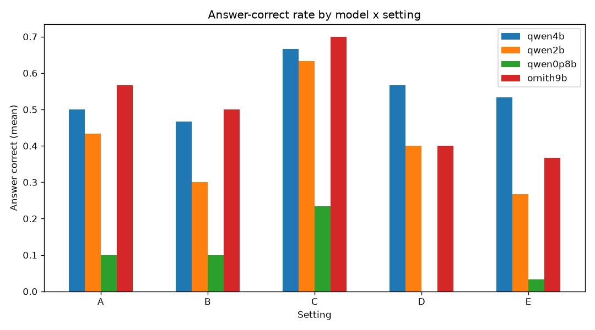
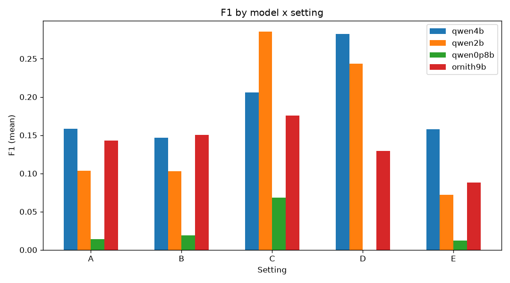
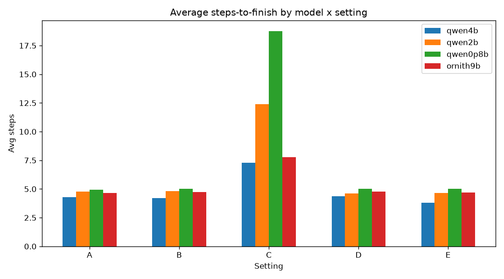
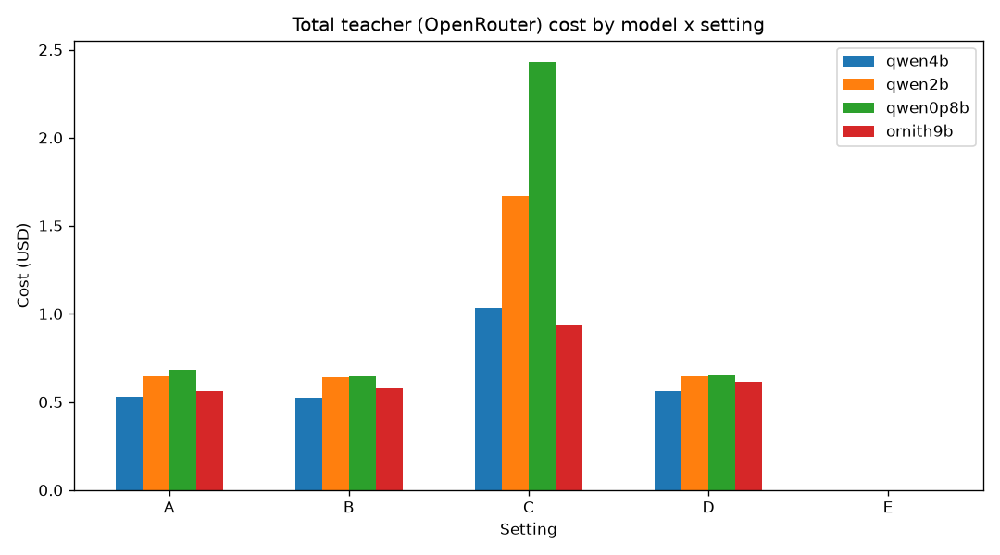
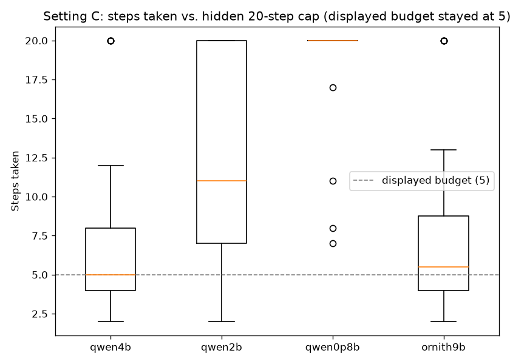

# Teacher Guidance experiment matrix report

4 student models x 5 teacher-guidance settings x 30 fixed random HotpotQA questions (teacher: `custom/z-ai/glm-5.2`).

## Settings

- **A** -- planning budget=5, running budget=5
- **B** -- planning budget=10, running budget=5
- **C** -- planning budget=5, running budget hidden-max=20 (never stated in a prompt)
- **D** -- planning budget=5, running budget=5, teacher authors the plan
- **E** -- no teacher guidance at all: student writes the plan, zero teacher LLM calls

## Models

- `qwen4b` -- `ollama/qwen3.5:4b`
- `qwen2b` -- `ollama/qwen3.5:2b`
- `qwen0p8b` -- `ollama/qwen3.5:0.8b`
- `ornith9b` -- `ollama/hf.co/deepreinforce-ai/Ornith-1.0-9B-GGUF:latest`

## Headline metrics

| Model | Setting | Episodes | Answer correct | EM | F1 | Doc recall | Avg steps | Median steps | Teacher calls | Tokens | Cost (USD) | Wall (s) |
|---|---|---|---|---|---|---|---|---|---|---|---|---|
| qwen4b | A | 30 | 0.5 | 0 | 0.1586 | 0.9 | 4.3 | 5 | 163 | 302689 | 0.5296 | 2814 |
| qwen4b | B | 30 | 0.4667 | 0 | 0.1466 | 0.9167 | 4.2 | 5 | 163 | 299467 | 0.5214 | 2735 |
| qwen4b | C | 30 | 0.6667 | 0.0333 | 0.2057 | 0.9333 | 7.267 | 5 | 261 | 570333 | 1.035 | 5353 |
| qwen4b | D | 30 | 0.5667 | 0.1333 | 0.2824 | 0.85 | 4.367 | 5 | 164 | 309510 | 0.5607 | 2713 |
| qwen4b | E | 30 | 0.5333 | 0 | 0.1577 | 0.9 | 3.8 | 4 | 0 | 0 | 0 | 457.7 |
| qwen2b | A | 30 | 0.4333 | 0 | 0.1035 | 0.9 | 4.767 | 5 | 181 | 378663 | 0.6442 | 2928 |
| qwen2b | B | 30 | 0.3 | 0 | 0.1027 | 0.8333 | 4.833 | 5 | 182 | 372003 | 0.6393 | 3330 |
| qwen2b | C | 30 | 0.6333 | 0.1 | 0.2856 | 0.9833 | 12.4 | 11 | 425 | 996853 | 1.67 | 6595 |
| qwen2b | D | 30 | 0.4 | 0.1 | 0.2438 | 0.9 | 4.6 | 5 | 177 | 347699 | 0.6463 | 2508 |
| qwen2b | E | 30 | 0.2667 | 0 | 0.0722 | 0.8667 | 4.633 | 5 | 0 | 0 | 0 | 495.3 |
| qwen0p8b | A | 30 | 0.1 | 0 | 0.0142 | 0.7833 | 4.933 | 5 | 187 | 370036 | 0.6838 | 2876 |
| qwen0p8b | B | 30 | 0.1 | 0 | 0.0188 | 0.8333 | 5 | 5 | 188 | 367128 | 0.6471 | 2601 |
| qwen0p8b | C | 30 | 0.2333 | 0 | 0.0684 | 0.9167 | 18.77 | 20 | 622 | 1464402 | 2.431 | 7648 |
| qwen0p8b | D | 30 | 0 | 0 | 0 | 0.8667 | 5 | 5 | 184 | 364184 | 0.6533 | 2520 |
| qwen0p8b | E | 30 | 0.0333 | 0 | 0.0121 | 0.7667 | 5 | 5 | 0 | 0 | 0 | 445.3 |
| ornith9b | A | 30 | 0.5667 | 0.0333 | 0.1432 | 0.9 | 4.667 | 5 | 177 | 331067 | 0.5626 | 2551 |
| ornith9b | B | 30 | 0.5 | 0.0333 | 0.1504 | 0.9 | 4.733 | 5 | 175 | 322506 | 0.5755 | 2643 |
| ornith9b | C | 30 | 0.7 | 0.0333 | 0.1754 | 0.9833 | 7.767 | 5.5 | 274 | 565448 | 0.9412 | 4302 |
| ornith9b | D | 30 | 0.4 | 0 | 0.1291 | 0.8833 | 4.767 | 5 | 179 | 336171 | 0.6111 | 2965 |
| ornith9b | E | 30 | 0.3667 | 0 | 0.088 | 0.8667 | 4.7 | 5 | 0 | 0 | 0 | 538 |

## Setting C: steps-taken distribution (hidden 20-step cap)

| Model | Min | Max | Mean | Median |
|---|---|---|---|---|
| qwen4b | 2 | 20 | 7.267 | 5 |
| qwen2b | 2 | 20 | 12.4 | 11 |
| qwen0p8b | 7 | 20 | 18.77 | 20 |
| ornith9b | 2 | 20 | 7.767 | 5.5 |

## Plots

## Totals

- Total OpenRouter (teacher) cost: **$13.3521**
- Total tokens (student + teacher, all calls): **7,698,159**
- Question set: 30 fixed HotpotQA qids (seed 2026): `5a73626b55429901807db01e, 5a7438ec55429979e28828b8, 5a746a4455429974ef308bf6, 5a75140b5542996c70cfae87, 5a7587705542992db9473674, 5a75fa14554299109176e5dc, 5a77309d55429972597f1487, 5a77bef05542992a6e59dfaf, 5a7b2a2255429927d897bf4c, 5a7b581a5542992d025e6815, 5a7ef49a5542994959419a91, 5a836a765542996488c2e446, 5a891e1e5542993b751ca913, 5a8dce155542994ba4e3dd24, 5a8ed30655429917b4a5bdcd, 5a906f9f5542995b442420b3, 5ab43b755542991779162c21, 5abb07ec5542996cc5e49f55, 5ac3d68f554299076e296ca6, 5ac4920d5542996feb3fe8d3, 5adbfbd555429947ff173893, 5add2df85542992ae4cec4d6, 5add95035542990dbb2f7e77, 5ade24e35542992fa25da6e6, 5ade64b655429939a52fe89a, 5ade74285542992fa25da78c, 5adfdd1c55429906c02daa74, 5ae4ad3155429913cc2044cb, 5ae526c455429908b6326529, 5ae55dda5542992663a4f1e9`
