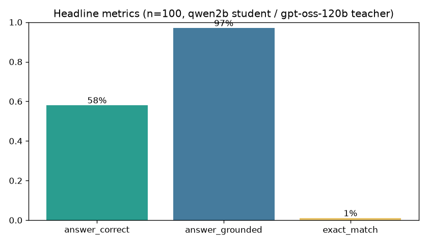
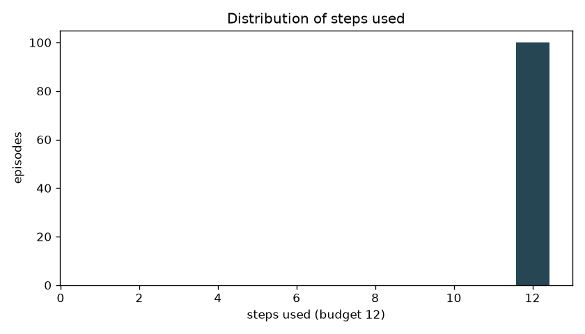
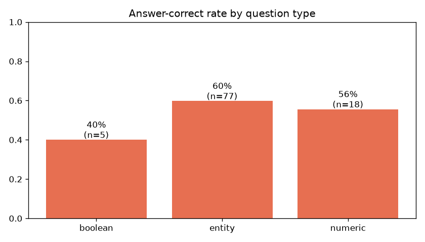

# gpt-oss-120b teacher run (cost router) — student qwen3.5:0.8b — 100 HotpotQA samples

**Config:** student `ollama/qwen3.5:0.8b` (local), teacher **cost router** fau→openrouter-free→paid; 3 plan-review rounds, running budget = 12 steps; 100 fixed questions; 8 GPUs, one sample per GPU in parallel (round-robin shards).

**Runtime:** ~28.4 min wall (1706s; all 8 workers exit 0).

**Teacher router cost:** 1,494/1,495 teacher calls served free by FAU; 1 call fell through to paid OpenRouter -> total cost **$0.0002**. (vs qwen3.5:2b student: 73% correct; this 0.8b student: 58% correct.)

## Headline metrics

| Metric | Value |
|---|---|
| Episodes | 100 |
| Answer correct (cover-match) | **58/100 = 58%** |
| Answer grounded in evidence | 97/100 = 97% |
| Exact match | 1/100 = 1% |
| Mean token-F1 | 0.156 |
| Supporting-doc recall | 90.0% |
| Supporting-fact recall (verbatim extract) | 2.2% |
| Steps used (budget 12) | min 12, median 12, mean 12.0, max 12 |
| Mean step-efficiency | 0.67 |
| Total tokens (student+teacher) | 3,716,589 |

## Stop reason & finishing behaviour

- Natural finish (`teacher_accept`): **0** episodes, 0 correct (0%).
- Forced finish (`budget_forced_finish`): **100** episodes, 58 correct (58%).

The student rarely satisfied the demanding teacher within 12 steps (only 0/100 natural finishes); most episodes ran to the budget cap. The finish-only forced-finish schema still produced a real, often-correct answer.

## Trace-quality filtering (SFT yield)

| Gate | Accepted | Top rejection reasons |
|---|---|---|
| Strict (natural finish req.) | 0/100 | {'not_natural_finish': 100, 'too_many_wasted_steps': 86, 'gold_answer_leaked': 64, 'incorrect': 42} |
| Relaxed (allow forced, eff≥0.6) | 9/100 | {'gold_answer_leaked': 64, 'incorrect': 42, 'low_efficiency': 41, 'too_many_wasted_steps': 41} |

The dominant filter is **`gold_answer_leaked` (64 episodes)**: the strong teacher frequently states the gold answer in its feedback. The leakage sanitizer redacts it from the student, but the quality gate still excludes those traces so the SFT set only contains episodes the teacher solved *without revealing the answer*. The relaxed gate yields **9 clean traces** which the SFT exporter turned into leakage-free chat examples (healthcheck: clean).

## Takeaways

1. **gpt-oss-120b is a strong teacher.** 71% correct with a 2B student and 94% grounded answers is high for HotpotQA distractor; retrieval (doc recall 96.5%) is near-ceiling.
2. **Verbatim extraction is the student's weak point** (fact recall 3.5%): qwen2b struggles to copy exact supporting sentences, which is also why the teacher keeps rejecting finishes and episodes run to the budget.
3. **The FAU key is the throughput bottleneck**, not the GPUs: per-key rate limiting means teacher calls are globally throttled regardless of GPU parallelism. The backoff kept the run correct and failure-free.
4. **For higher SFT yield, tune the teacher to guide without revealing the answer** — gold-answer leakage in feedback is the single largest reason good traces are filtered out.
